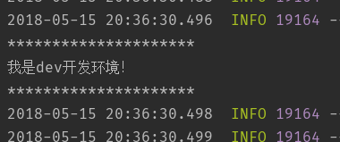

# Spring Boot ProfileTest

最近在配置毕业设计项目的生产环境，在配置Jenkins的时候在想`profile生效的优先级`，就是在`application.yml`中配置了`spring.profiles.active`之后，能不能通过`--spring.profiles.active`覆盖掉这个配置，所以有了这个项目。

## 配置三个配置文件

1. application.yml
```yaml
spring:
  profiles:
    active: dev
```

2. application-dev.yml
```yaml
demo:
  name: 我是dev开发环境！
```

3. application-pro.yml
```yaml
demo:
  name: 我是pro生产环境！
```

## 一个配置实体类

```java
@Component("demoSettings")
@ConfigurationProperties(prefix = "demo")
public class DemoSettings {

    private String name;

    public String getName() {
        return name;
    }

    public void setName(String name) {
        this.name = name;
    }
}
```

## Main

```java
    public static void main(String[] args) {
        ConfigurableApplicationContext ctx = SpringApplication.run(ProfileTestApplication.class, args);
        DemoSettings demoSettings = (DemoSettings) ctx.getBean("demoSettings");

        System.out.println("*********************");
        System.out.println(demoSettings.getName());
        System.out.println("*********************");
    }
```

## 开始测试

* 在IDE中直接启动项目



* 在`PowerShell`中使用`java -jar profiletest-0.0.1-SNAPSHOT.jar --spring.profiles.active=pro`启动项目


## 结论

实际说明`--spring.profiles.active`是能覆盖配置文件中的配置的，所以开发人员可以直接clone下来开发，而生产环境中只需要在启动脚本加上`--spring.profiles.active=pro`即可。